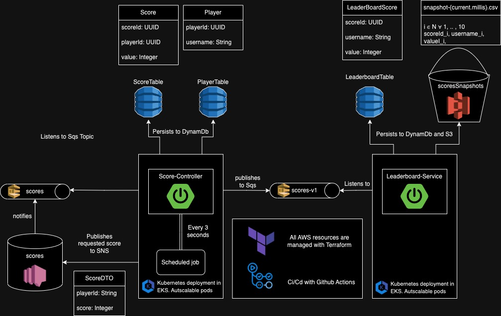

# Score Controller

Score Controller is a Java application that manages and tracks scores for players. It integrates with AWS services, including SNS for asynchronous notifications and DynamoDB for data storage.



## Table of Contents
- [Score Controller](#score-controller)
    - [Table of Contents](#table-of-contents)
    - [Introduction](#introduction)
    - [Prerequisites](#prerequisites)
    - [Getting Started](#getting-started)
        - [Installation](#installation)
        - [Docker Installation](#docker-installation-and-usage)
        - [Configuration](#configuration)
    - [Usage](#usage)
      - [Score API](#score-api)
      - [Player API](#player-api)
      - [Open API](#openapi)
    - [AWS Configuration](#aws-configuration)
    - [To be Implemented](#to-be-implemented)
    - [Contributing](#contributing)

--- 

## Introduction

Score Controller is a Java application that allows you to manage and track scores for players. It provides a set of APIs to create, retrieve, update, and delete player scores. The application uses Amazon Web Services (AWS) for asynchronous notifications and data storage.

---

## Prerequisites

Before you get started, make sure you have the following prerequisites in place:

- Java Development Kit (JDK)
- Apache Maven
- AWS Account with necessary credentials

## Getting Started

Follow these steps to get Score Controller up and running:

### Installation

1. Clone this repository to your local machine:

```shell
git clone https://github.com/tomassirio/score-controller.git
```
2. Change to the project directory:

```shell
cd score-controller
```
    
3. Build the project using the Maven wrapper:

```shell
./mvnw clean install
```

### Docker Installation and Usage
Docker allows you to containerize your Score Controller application for portability and easy deployment. Follow these steps to build and run your application within a Docker container:

Install Docker: If you don't have Docker installed, you can download and install it from the official Docker website.

#### Build a Docker Image:

Build a Docker image for your Score Controller application using the provided Dockerfile. Make sure you are in the project directory:

```shell
docker build -t score-controller .
```

This command creates a Docker image named "score-controller."

#### Run the Docker Container:

After building the Docker image, you can run it as a container. Be sure to configure your AWS credentials as environment variables to enable communication with AWS services. Replace [YOUR_ACCESS_KEY] and [YOUR_SECRET_KEY] with your AWS credentials:

```shell
docker run -e AWS_ACCESS_KEY_ID=[YOUR_ACCESS_KEY] -e AWS_SECRET_ACCESS_KEY=[YOUR_SECRET_KEY] -p 8080:8080 score-controller
```

This command starts a Docker container from the "score-controller" image, maps port 8080 from the container to your host machine, and provides AWS credentials as environment variables.

#### Access the Application:

Once the Docker container is running, you can access your Score Controller application at http://localhost:8080/swagger-ui/index.html#/ in your web browser or by making HTTP requests to the API endpoints as described in the Usage section.

### Configuration

Before running the application, you need to configure it. Create a application.properties file with the following content:

```properties
aws.region=eu-west-2
aws.sns.topic.name=scores
aws.sns.topic.arn=ScoresARN
score.table=ScoreTable
player.table=PlayerTable
```

---

## Usage

To use the Score Controller application, you can interact with it through its RESTful API. Below are some example API endpoints:

#### Score API

```properties
Create a new score for a player:
@RequestParam String playerId, @RequestParam Integer value
POST /score/{playerId}

Get score:
@RequestParam String scoreId
GET /score/

Retrieve the scores for a player:
@RequestParam String playerId
GET /scores/player

Retrieve highest score by player
@RequestParam String playerId
GET /scores/player/highest

Update the score for a player:
@RequestParam String scoreId, @RequestParam Integer value
PUT /score/

Delete the score for a player:
@RequestParam String scoreId
DELETE /score/
```

#### Player API

```properties
Create a new player:
@RequestParam String playerId
POST /player

Get all players:
GET /player/all

Retrieve player by id 
@RequestParam String playerId
GET /player

Update Player's username:
@RequestParam String playerId, String userName
PUT /player

Delete a player:
@RequestParam String playerId
DELETE /player
```

You can use tools like curl, Postman to make HTTP requests to these endpoints, or you could as well use the OpenApi documentation.

### OpenAPI

Use the following URL to access OpenApi's documentation once a local instance is running

```
http://localhost:8080/swagger-ui/index.html#/
```

---

## AWS Configuration
Score Controller integrates with AWS services. Ensure you have the necessary AWS credentials configured to access AWS services. The application requires permissions to publish to SNS topics and read/write data from DynamoDB tables.

---------------------------------------
---------------------------------------

# To be Implemented
As you all know, we all have jobs and lives outside them. Hence, this implementation is not yet finished.

### What's coming next?

- Deploy the project with Kubernetes to EKS
- Rename Scheduled publisher to Cron module
- Create different environments (dev, stg, pro)
- Publish finished scores to SQS scores_v1 topic
- Create Leaderboard service as a separate project 
- Create DynamoDb to Store only 10 highest scores (or something, I'm flexible)
- Create S3 bucket to create and store snapshots every time the leaderboard is updated
- Create Terraform files to deploy and manage AWS resources
- Configure Auto-Scaling functionalities to EKS deployment 
- Implement logging system (ElasticSearch)
- Implement metrics system (Prometheus, Grafana)
- Implement cache for both services 

---------------------------------------
---------------------------------------

## Contributing
Contributions are welcome! To contribute to Score Controller, follow these steps:

- Fork the repository.
- Create a new branch for your feature or bug fix.
- Make your changes and commit them.
- Push your changes to your fork.
- Create a pull request.
- Please follow our contribution guidelines and provide clear details in your pull request.